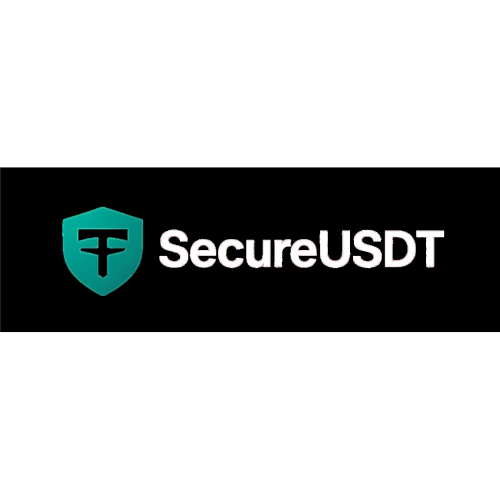

# 🚀 SecureUSDT - Cryptocurrency Investment Platform

<div align="center">



**A Full-Stack Cryptocurrency Investment Platform with Advanced Features**

[](https://reactjs.org/)
[](https://nodejs.org/)
[](https://mongodb.com/)
[](https://aws.amazon.com/)

[Live Demo](#) • [Documentation](#) • [Report Bug](#) • [Request Feature](#)

</div>

---

## 📋 **Project Overview**

**SecureUSDT** is a comprehensive, full-stack cryptocurrency investment platform that enables users to invest in USDT (Tether) with various lock-in plans, track profits, manage transactions, and provides both user and admin interfaces for complete investment management. Built with modern technologies and best practices.

### 🎯 **Key Features**
- **💰 Investment Management** - Multiple lock-in plans with automated profit calculation
- **📧 Email Notifications** - Comprehensive email system with AWS SES integration
- **🔐 Security First** - JWT authentication, rate limiting, and secure API design
- **📱 Responsive Design** - Mobile-first approach with modern UI/UX
- **👥 User Management** - Complete user and admin management system
- **📊 Analytics** - Real-time profit tracking and transaction monitoring
- **🔄 Real-time Updates** - Live transaction updates and notifications

---

## 🏗️ **Architecture & Technology Stack**

### **Frontend Technologies**
| Technology | Version | Purpose |
|------------|---------|---------|
| **React** | 19.1.1 | Modern UI framework with hooks and context |
| **Vite** | 7.1.2 | Lightning-fast build tool and dev server |
| **Ant Design** | 5.27.1 | Professional UI component library |
| **React Router** | 7.8.2 | Client-side routing and navigation |
| **Axios** | 1.11.0 | HTTP client for API communication |
| **React Toastify** | 11.0.5 | Toast notifications and user feedback |

### **Backend Technologies**
| Technology | Version | Purpose |
|------------|---------|---------|
| **Node.js** | Latest | JavaScript runtime environment |
| **Express** | 5.1.0 | Web application framework |
| **MongoDB** | Latest | NoSQL database for data storage |
| **Mongoose** | 8.17.1 | MongoDB object modeling |
| **JWT** | Latest | Secure authentication tokens |
| **AWS SES** | Latest | Email service integration |
| **TronWeb** | 6.0.4 | TRON blockchain integration |

### **Security & Infrastructure**
- **🔐 JWT Authentication** - Secure user sessions and role-based access
- **🛡️ Rate Limiting** - API request throttling and DDoS protection
- **🔒 Environment Variables** - Secure configuration management
- **📧 AWS SES Integration** - Professional email notifications
- **🌐 CORS Protection** - Cross-origin security
- **📊 Request Logging** - Comprehensive API monitoring

---

## 🚀 **Key Features & Functionality**

### **👤 User Features**
- **🔐 Secure Authentication** - JWT-based login/registration system
- **📊 Investment Dashboard** - Real-time portfolio overview and analytics
- **💰 Lock-in Plans** - Multiple investment options with different durations
- **📈 Profit Tracking** - Automated profit calculation and history
- **💸 Withdrawal System** - Secure withdrawal request and processing
- **🔄 Internal Transfers** - Wallet-to-wallet transfers between users
- **👥 Referral System** - User referral program with bonus rewards
- **📧 Email Notifications** - Automated email alerts for all activities
- **📱 Mobile Responsive** - Optimized for all device sizes

### **👨‍💼 Admin Features**
- **📊 Admin Dashboard** - Comprehensive system overview and analytics
- **👥 User Management** - Complete user account management
- **💼 Transaction Monitoring** - Real-time transaction tracking
- **💰 Withdrawal Processing** - Secure withdrawal approval system
- **📋 Lock-in Plans Management** - Investment plan configuration
- **❓ FAQ Management** - Dynamic FAQ system
- **📧 Email System Monitoring** - Email delivery tracking
- **📈 Financial Reports** - Comprehensive analytics and reporting

### **📧 Email Notification System**
- **🎉 Welcome Emails** - New user onboarding
- **✅ Deposit Confirmations** - Investment confirmation emails
- **🚨 Withdrawal Alerts** - Admin notifications for withdrawal requests
- **💸 Withdrawal Success** - User confirmation emails
- **🔄 Transfer Notifications** - Internal transfer confirmations
- **🎁 Referral Bonuses** - Bonus notification emails

---

## 📁 **Project Structure**

```
SecureUSDT/
├── 📁 client/                          # React Frontend Application
│   ├── 📁 src/
│   │   ├── 📁 api_calls/              # API integration layer
│   │   ├── 📁 assets/                 # Images, logos, and static files
│   │   ├── 📁 components/             # Reusable React components
│   │   ├── 📁 contexts/               # React Context providers
│   │   ├── 📁 pages/                  # Page components
│   │   │   ├── 📁 adminPages/         # Admin interface pages
│   │   │   ├── 📁 pageLayouts/        # Layout components
│   │   │   ├── 📁 startingPages/     # Authentication pages
│   │   │   ├── 📁 static/             # Static content pages
│   │   │   └── 📁 userPages/          # User interface pages
│   │   ├── 📁 styles/                 # CSS and styling files
│   │   └── 📄 App.jsx                 # Main application component
│   ├── 📄 package.json                # Frontend dependencies
│   └── 📄 vite.config.js              # Vite configuration
├── 📁 usdtBackend/                     # Node.js Backend Application
│   ├── 📁 controllers/                 # API route controllers
│   │   ├── 📄 userController.js       # User management + Welcome emails
│   │   ├── 📄 lockinController.js     # Investment management + Deposit emails
│   │   ├── 📄 withdrawalRequestController.js # Withdrawal + Email alerts
│   │   ├── 📄 transferController.js   # Internal transfers + Email notifications
│   │   └── 📄 paymentController.js    # Payment processing + Referral emails
│   ├── 📁 models/                      # Database models
│   ├── 📁 repos/                       # Data access layer
│   ├── 📁 routes/                      # API route definitions
│   ├── 📁 services/                    # Business logic services
│   │   └── 📄 emailService.js         # Email templates and sending
│   ├── 📁 middleware/                  # Custom middleware
│   ├── 📄 server.js                    # Main server file
│   ├── 📄 .env                         # Environment variables
│   └── 📄 package.json                 # Backend dependencies
└── 📄 README.md                        # Project documentation
```

---

## 🛠️ **Installation & Setup**

### **Prerequisites**
- Node.js (v16 or higher)
- MongoDB
- AWS Account (for SES email service)
- Git

### **Quick Start**

#### **1. Clone the Repository**
```bash
git clone https://github.com/yourusername/secureusdt.git
cd secureusdt
```

#### **2. Backend Setup**
```bash
cd usdtBackend
npm install
cp .env.example .env
# Edit .env with your configuration
npm start
```

#### **3. Frontend Setup**
```bash
cd client
npm install
npm run dev
```

#### **4. Environment Configuration**
Create `.env` file in `usdtBackend/` directory:
```env
# Database
MONGODB_URI=mongodb://localhost:27017/secureusdt

# JWT Authentication
JWT_SECRET=your_super_secure_jwt_secret_key
JWT_EXPIRES_IN=24h

# AWS SES Configuration
AWS_ACCESS_KEY_ID=your_aws_access_key_id
AWS_SECRET_ACCESS_KEY=your_aws_secret_access_key
AWS_REGION=ap-south-1

# Email Addresses
FROM_EMAIL=noreply@secureusdt.com
PAYMENTS_EMAIL=payments@secureusdt.com
ADMIN_EMAIL=admin@secureusdt.com

# Server Configuration
PORT=5002
NODE_ENV=development
```

---

## 🔧 **API Documentation**

### **Authentication Endpoints**
| Method | Endpoint | Description |
|--------|----------|-------------|
| `POST` | `/api/login` | User authentication |
| `POST` | `/api/register` | User registration (triggers welcome email) |
| `POST` | `/api/admin/login` | Admin authentication |

### **User Endpoints**
| Method | Endpoint | Description |
|--------|----------|-------------|
| `GET` | `/api/user/dashboard` | User dashboard data |
| `POST` | `/api/user/lockin` | Create lock-in investment (triggers deposit email) |
| `GET` | `/api/user/transactions` | User transaction history |
| `POST` | `/api/user/withdraw` | Request withdrawal (triggers admin alert email) |

### **Admin Endpoints**
| Method | Endpoint | Description |
|--------|----------|-------------|
| `GET` | `/api/admin/users` | Get all users |
| `GET` | `/api/admin/transactions` | Get all transactions |
| `PUT` | `/api/admin/withdraw/:id` | Process withdrawal (triggers success email) |

### **Transfer Endpoints**
| Method | Endpoint | Description |
|--------|----------|-------------|
| `POST` | `/api/transfer` | Internal transfer (triggers recipient email) |

---

## 📊 **Database Schema**

### **Core Models**
- **👤 User** - User accounts, profiles, and authentication
- **👨‍💼 Admin** - Admin user accounts and permissions
- **💼 Wallet** - User wallet information and balances
- **💸 Transactions** - All financial transactions and history
- **🔒 Lockin** - User lock-in investments and plans
- **📋 LockinPlans** - Available investment plans and configurations
- **📈 Profit** - Profit calculations and historical data
- **💸 WithdrawRequest** - Withdrawal requests and processing
- **❓ FAQ** - Frequently asked questions and answers

---

## 🎨 **UI/UX Features**

### **Design System**
- **🌙 Dark Theme** - Modern dark color scheme with professional styling
- **📱 Mobile-First** - Responsive design optimized for all devices
- **🎯 User-Centric** - Intuitive navigation and user experience
- **⚡ Performance** - Fast loading and smooth interactions
- **♿ Accessibility** - WCAG compliant design patterns

### **Component Library**
- **Ant Design Components** - Professional UI components
- **Custom Styling** - Brand-specific design system
- **Loading States** - User feedback during operations
- **Error Handling** - Comprehensive error management
- **Toast Notifications** - Real-time user feedback
- **Modal Dialogs** - Interactive user interfaces

---

## 🔐 **Security Implementation**

### **Authentication & Authorization**
- **🔑 JWT Tokens** - Secure user sessions and role-based access
- **🔒 Password Hashing** - Bcrypt encryption for user passwords
- **🛡️ Rate Limiting** - API request throttling and DDoS protection
- **🌐 CORS Protection** - Cross-origin resource sharing security
- **📝 Input Validation** - Data sanitization and validation
- **🔐 Protected Routes** - Role-based access control

### **Data Security**
- **🔒 Environment Variables** - Secure configuration management
- **🛡️ API Security** - Secure API design and implementation
- **📊 Request Logging** - Comprehensive API monitoring
- **🔐 Secret Management** - Secure handling of sensitive data

---

## 📧 **Email System Architecture**

### **Email Templates**
- **🎉 Welcome Email** - New user onboarding and platform introduction
- **✅ Deposit Success** - Investment confirmation with transaction details
- **🚨 Withdrawal Request Alert** - Admin notifications for withdrawal requests
- **💸 Withdrawal Success** - User confirmation for successful withdrawals
- **🔄 Internal Transfer** - Transfer notifications for recipients
- **🎁 Referral Bonus** - Bonus notifications for referrers

### **Email Features**
- **📧 AWS SES Integration** - Professional email delivery service
- **🎨 HTML Templates** - Responsive email designs
- **📱 Mobile Optimized** - Email templates optimized for mobile devices
- **🔄 Error Handling** - Non-blocking email sending with retry logic
- **📊 Delivery Tracking** - Comprehensive email delivery monitoring

---

## 🚀 **Deployment & Production**

### **Production Build**
```bash
# Frontend Build
cd client
npm run build

# Backend Start
cd usdtBackend
npm start
```

### **Environment Configuration**
- **🌍 Production Environment** - Configure production environment variables
- **🗄️ Database Setup** - Set up MongoDB production database
- **📧 Email Service** - Configure AWS SES for production
- **🔗 Blockchain Integration** - Set up TronWeb for production
- **🔐 Security** - Implement production security measures

---

## 📈 **Performance & Monitoring**

### **Performance Features**
- **⚡ Fast Loading** - Optimized bundle sizes and lazy loading
- **📊 Real-time Updates** - Live data updates without page refresh
- **🔄 Caching** - Intelligent caching for improved performance
- **📱 Mobile Optimization** - Optimized for mobile devices

### **Monitoring & Analytics**
- **📊 Request Logging** - Comprehensive API request monitoring
- **📧 Email Tracking** - Email delivery and bounce monitoring
- **🔍 Error Tracking** - Error logging and debugging
- **📈 Performance Metrics** - Application performance monitoring

---

## 🧪 **Testing & Quality Assurance**

### **Testing Strategy**
- **🔍 Manual Testing** - Comprehensive manual testing of all features
- **📱 Cross-browser Testing** - Testing across different browsers
- **📱 Mobile Testing** - Mobile device compatibility testing
- **🔐 Security Testing** - Security vulnerability assessment

### **Quality Assurance**
- **📝 Code Review** - Peer review process for code quality
- **🔍 Linting** - Code quality and style enforcement
- **📊 Performance Testing** - Load testing and performance optimization
- **🛡️ Security Auditing** - Security best practices implementation

---

## 🤝 **Contributing**

### **Development Workflow**
1. **🍴 Fork the Repository** - Create your own fork
2. **🌿 Create Feature Branch** - `git checkout -b feature/AmazingFeature`
3. **💾 Commit Changes** - `git commit -m 'Add some AmazingFeature'`
4. **📤 Push to Branch** - `git push origin feature/AmazingFeature`
5. **🔄 Create Pull Request** - Submit a pull request for review

### **Code Standards**
- **📝 ESLint Configuration** - Consistent code formatting
- **🎨 Prettier Integration** - Code formatting and style
- **📚 Documentation** - Comprehensive code documentation
- **🧪 Testing** - Test coverage for new features

---

## 📞 **Support & Contact**

### **Technical Support**
- **📧 Email Support** - Contact through the application
- **📚 Documentation** - Comprehensive project documentation
- **🐛 Bug Reports** - Report issues through GitHub issues
- **💡 Feature Requests** - Suggest new features and improvements

### **Project Information**
- **👨‍💻 Developer** - [Your Name](https://github.com/yourusername)
- **📧 Email** - your.email@example.com
- **🌐 Portfolio** - [Your Portfolio Website](https://yourportfolio.com)
- **💼 LinkedIn** - [Your LinkedIn Profile](https://linkedin.com/in/yourprofile)

---

## 📄 **License**

This project is proprietary software. All rights reserved.

**© 2025 SecureUSDT. All rights reserved.**

---

## 🏆 **Project Highlights**

### **Technical Achievements**
- ✅ **Full-Stack Development** - Complete frontend and backend implementation
- ✅ **Modern Architecture** - Microservices architecture with clean separation
- ✅ **Security First** - Comprehensive security implementation
- ✅ **Scalable Design** - Built for growth and scalability
- ✅ **Production Ready** - Complete deployment and monitoring setup

### **Business Value**
- 💰 **Revenue Generation** - Complete investment platform with profit tracking
- 👥 **User Management** - Comprehensive user and admin management
- 📧 **Communication** - Automated email notification system
- 📊 **Analytics** - Real-time analytics and reporting
- 🔒 **Security** - Enterprise-grade security implementation

---

<div align="center">

**🚀 SecureUSDT - Secure, Reliable, Profitable Cryptocurrency Investment Platform**

*Built with ❤️ by [Your Name](https://github.com/yourusername)*

[](https://github.com/yourusername/secureusdt)
[](https://linkedin.com/in/yourprofile)
[](https://yourportfolio.com)

</div>